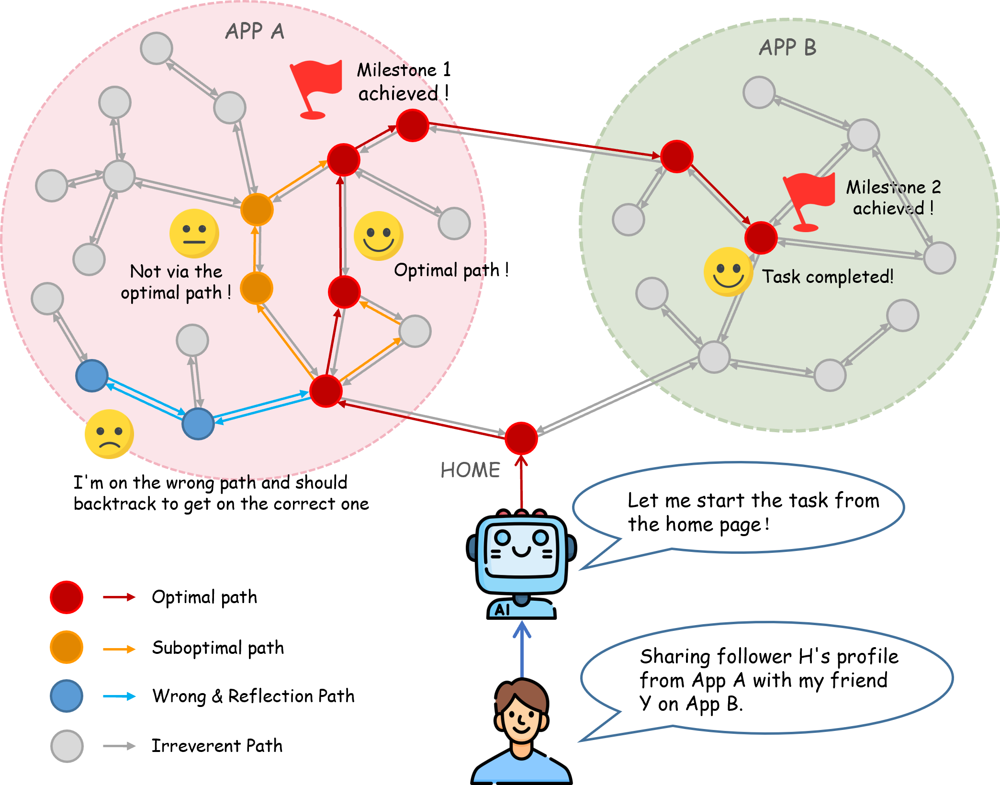
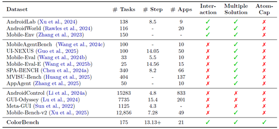
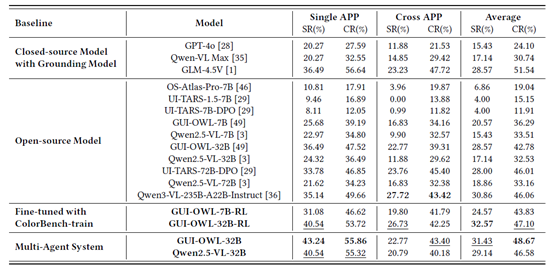

<!-- <p align="center">
    <a href="README_zh.md">简体中文</a> | <a href="README.md">English</a> 
</p> -->

# <a id="简体中文"></a>🎨 ColorBench：基于图结构的复杂长程任务移动智能体评测基准

<p align="center">
  <a href="README.md">English</a> | <a href="README_zh.md">简体中文</a>
</p>

👋 欢迎访问 **ColorBench** 仓库 —— 一个面向移动端 GUI 智能体的 **图结构评测基准**，用于评估智能体在复杂长程任务及其原子子任务上的性能。项目主要特点包括：
- 提供一套 **图结构评测构建方法学**，便于扩展或重建任务图；
- 提供一个 **可插拔式评测框架**，实现安全、可复现的智能体测试。

<!--  -->


---

## 📢 最新动态
- **[xx Oct '25]** 已开放核心代码与数据集（含评测环境及任务图）。
- **[16 Oct '25]** 我们的论文 [*ColorBench: Benchmarking Mobile Agents with Graph Structured Framework for Complex Long-Horizon Task*](https://arxiv.org/abs/2510.14621) 已发布在 arXiv！

---

## 🧭 概览

<!--  -->


### 📦 175 个复杂长程任务
- 🌐 覆盖 **21 个主流应用** —— 微信、美团、京东、小红书等；
- 🔄 包含 **101 个跨应用任务** 与 **74 个单应用任务**；
- 🧭 平均最优路径长度超过 13 步。

### 🎨 图结构设计与多路径评测
- 🔀 包含多条正确路径与典型错误路径；
- 🔁 支持智能体的 **反思**、**重规划** 与 **回溯** 行为。

### 📊 全面评测指标
- ✅ 三大核心指标：**成功率（SR）**、**完成率（CR）**、**原子能力（AC）**；
- 🧩 15 类原子能力 —— 如搜索、筛选、保存、分享、记忆等；
- 🎯 可精细诊断智能体在原子层级的薄弱环节。

### 🤖 可插拔式评测框架
- 📱 静态但可交互的图环境；
- 📐 无需真实设备或账户即可安全复现；
- 🧰 全自动化评测，无需人工验证。



---

## 📂 项目结构

```plaintext
ColorBench/
├── config/
│   ├── default.yaml                # 智能体评测配置
│   └── customized_config...
├── data/
│   ├── graph.json                  # 图结构信息
│   ├── task.json                   # 任务信息
│   ├── graph_image/                # 截图数据
│   │   ├── Screenshot0.png
│   │   ├── Screenshot1.jpg
│   └── ...
├── HammerEnv/                      # 基于广度优先的轨迹采集环境
├── src/
│   ├── agent/                      # 智能体定义与评测逻辑
│   ├── graph_construction/         # 图构建模块
│   ├── test/                       # 评测脚本
│   └── utils.py
├── construct_graph.py
├── run_colorbench_multi_agent.py
├── run_colorbench.py
└── README.md
```

---

## 🚀 快速开始

### 🛠️ 安装依赖
```bash
git clone https://github.com/MadeAgents/ColorBench
cd ColorBench
pip install -r requirements.txt
```

### 🧪 运行评测
```bash
python3 run_colorbench.py --config configs/default.yaml --model your_model_name
```
或使用脚本：
```bash
bash run_colorbench.sh
```

#### 自定义智能体
在 `src/agent/agent_base.py` 中继承 **AgentBase** 类并实现 `agent_step` 函数，用于执行动作与记录日志。
随后在 `run_colorbench.py` 中注册该智能体，并可在 `./config/` 下添加新的评测配置文件。

评测结果将保存在 `./checkpoints/` 目录下。

### 🧩 图结构评测构建

#### 基于广度优先的应用探索

我们使用自开发的安卓设备交互环境 **HammerEnv** 进行基于广度优先的应用探索。HammerEnv 是一个全面的安卓设备交互环境，可实现移动应用的动态探索和自动化操作。

#### 安装步骤


1) **下载并安装 android_env、android_world 两个开源项目**:
```plaintext
https://github.com/google-deepmind/android_env
https://github.com/google-research/android_world
注：pip 安装时需要使用编辑模式 pip install -e . 
```
2) **配置ADB连接**:
参见https://developer.android.com/tools

3) **设置环境变量**：
```bash
export OPENAI_API_KEY="EMPTY"
export OPENAI_BASE_URL="http://xxx.xxx.xxx.xxx/v1""
```

4. **启动交互环境服务器**：
```bash
python HammerEnv/src/server/gradio_web_server_physical_device.py
```

5. **运行 BFS 应用探索器**：
```bash
python HammerEnv/examples/bfs_app_explorer_fixed.py
```

#### 配置

##### 探索配置参数
| 参数 | 描述 | 默认值 |
|------|------|--------|
| `max_depth` | 最大探索深度 | 3 |
| `max_trajectories` | 要生成的最大轨迹数 | 50 |
| `app_name` | 目标应用名称 | "小红书" |
| `output_dir` | 轨迹输出目录 | "trajectories" |
| `delay_between_actions` | 动作之间的延迟（秒） | 2.0 |
| `model_name` | 用于分析的 AI 模型名称 | "Qwen2.5-VL-72B-Instruct" |
| `reset_environment_per_task` | 每个任务后重置环境 | True |
| `reset_delay` | 环境重置延迟（秒） | 1.0 |

##### 命令行参数
```bash
python examples/bfs_app_explorer_fixed.py \
    --server-name "http://localhost:7880/" \
    --model-name "xxx" \
    --app-name "小红书" \
    --max-depth 3 \
    --max-trajectories 20 \
    --output-dir "trajectories" \
    --delay 2.0
```
#### 基于深度优先的应用探索

为了捕捉用户长程任务，我们采用深度优先的方式手动截取操作手机的截图序列，然后通过 AI 模型分析生成结构化轨迹数据。

##### 工作流程
1. **截图收集**：按操作顺序手动截取应用操作截图
2. **轨迹分析**：使用大模型分析相邻截图对
3. **动作识别**：提取精确的点击坐标、输入文本等操作
4. **轨迹生成**：基于轨迹数据构建轨迹文件

##### 使用方法
```bash
# 运行深度优先轨迹生成
python src/graph_construction/pic2trajectory.py
```

##### 输入要求示例如下
- **目录结构**：`dfs/pic/trajectory1/`
- **必需文件**：`query.txt`（任务描述）+ `Screenshot_step_*_raw.{png|jpg}`
- **命名规范**：按操作顺序编号的截图文件trajectory1代表第一条轨迹

##### 输出结果
- **轨迹文件**：`dfs/trajectory/trajectory1/trajectory_v0.txt`
- **邻接矩阵**：`dfs/trajectory/trajectory1/{query}.csv`

#### 轨迹采集输出结构

系统生成组织有序的轨迹数据，结构如下：

```plaintext
trajectories/
├── 小红书/
│   ├── 小红书.json
│   ├── Screenshot_2025-01-10-20-10-21_0.jpg
│   ├── Screenshot_2025-01-10-20-10-21_1.jpg
│   └── Screenshot_2025-01-10-20-10-21_2.jpg
└── 搜索/
    ├── 搜索.json
    ├── Screenshot_2025-01-10-20-15-30_0.jpg
    └── Screenshot_2025-01-10-20-15-30_1.jpg
```
#### 图合并
使用以下命令可将多个轨迹文件合并为一个完整的任务图：
```bash
python construct_graph.py --input_folder <trajectories> --output_file <path/to/graph.json>
```
合并过程中，我们默认使用了两种模型：
- models--BAAI--bge-large-zh-v1.5（用于文本特征嵌入）
- Qwen2.5-VL-72B（用于视觉语言理解）

你可以在 ./src/graph_construction/graph.py 中修改为自己的模型配置。生成的 graph.json 文件记录了图中节点与边的详细信息，其中节点信息格式如下：
```json
{
  "node_id": ,
  "screenlists": [
    {
      "screenshot_path": "",
      "node_description": ""
    }
  ],
  "ui_element_edge_list": [
    {
      "source_node": ,
      "target_node": ,
      "action_type": "",
      "action_parameter": {}
    }
  ]
}
```

#### 前端检测工具

完成图合并后，可使用前端检测工具对图数据进行人工校验。首先，将合并得到的 graph.json 转换为 CSV 格式：
- 修改 ./src/graph_construction/parse_json_to_cvs.py 中的
json_file（输入图文件路径）与 save_file（输出 CSV 文件路径）。
- 设置 ./src/graph_construction/matrix_analyzer.py 中的 BASE_RECORD_PATH 为图片所在路径。

运行以下命令：
```bash
python src/graph_construction/parse_json_to_cvs.py
python src/graph_construction/matrix_analyzer.py
```

最终将修改好的csv转回用于评测的json格式。
```bash
python src/graph_construction/matrix_to_json.py
```

#### 边界框标注
用于为界面元素生成自动化的边界框标注。
- 修改 src/graph_construction/image_jump_parser.py 文件中 main 函数的输入路径：图数据集 JSON 文件地址，图片文件夹路径；
- 设置所使用的模型服务秘钥。

运行以下命令完成自动标注：
```bash
python src/graph_construction/image_jump_parser.py
```

---

## 🤝 贡献与引用

欢迎通过 **Issue** 或 **Pull Request** 改进本项目。
如使用本项目，请引用以下论文：

> **ColorBench: Benchmarking Mobile Agents with Graph Structured Framework for Complex Long-Horizon Task**  
> [arXiv:2510.14621](https://arxiv.org/abs/2510.14621)

📚 数据集链接：[HuggingFace 数据集（占位符）](https://huggingface.co/datasets/ColorBench)

---

<p align="center">⭐ If you find this project helpful, please give us a star on GitHub!</p>

